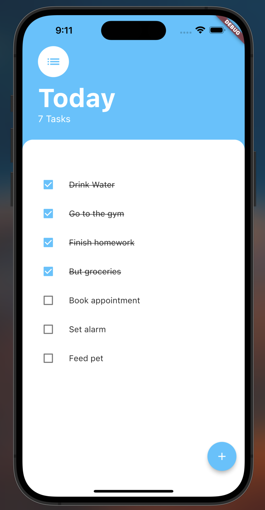
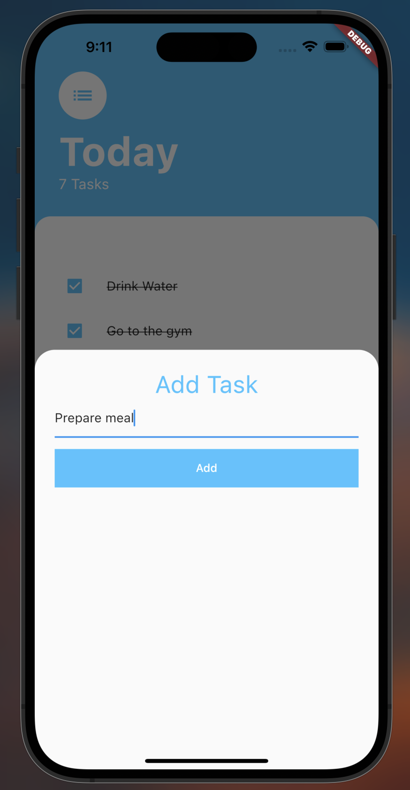

# ToDo List

A to do list app where users can add tasks and track them.

In this project, I learned:
- Why we need to manage state across our widget tree.
- Declarative vs. imperative programming.
- How setState works under the hood.
- Learn about prop drilling and lifting state up.
- About the BottomSheet widget and the ListViewBuilder.
- Flutter app architecture design patterns.
- Managing state with the Google recommended Provider package.

  
&nbsp; &nbsp; &nbsp; &nbsp;
  

